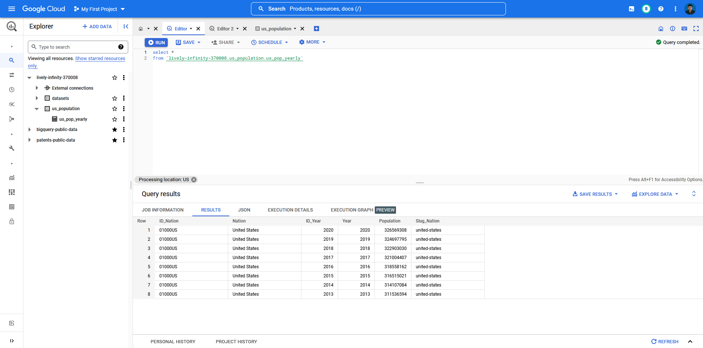

# Case 2 Data Fellowship 8 IYKRA

## Problems
Please create a DAG that extracts data from this API :
https://datausa.io/api/data?drilldowns=Nation&measures=Population

Then at the end of the pipeline it will be loaded into the bigquery external table as shown
previous meeting. The DAG task_id steps that need to be made are as follows:

call_dataset_task >> save_as_csv >> format_to_parquet_task >> local_to_gcs_task >>
bigquery_external_table_task

## How to run the query
1. Clone this repository to your computer.
2. Go to https://cloud.google.com/iam/docs/creating-managing-service-accounts to create gcp-service-accounts-credentials to get the google credentials, save it as google_credentials.json in  C:\Users\username\.google\credentials.
3. Open your terminal and run docker compose using this command:
    ``` bash
        docker compose -f docker-compose.yaml up
    ```
4. Open your browser and go to http://localhost:8080/home, input the username (airflow) and password (airflow).
5. Now you can see list of DAG on the airflow interface, run dag1.

## Result
 