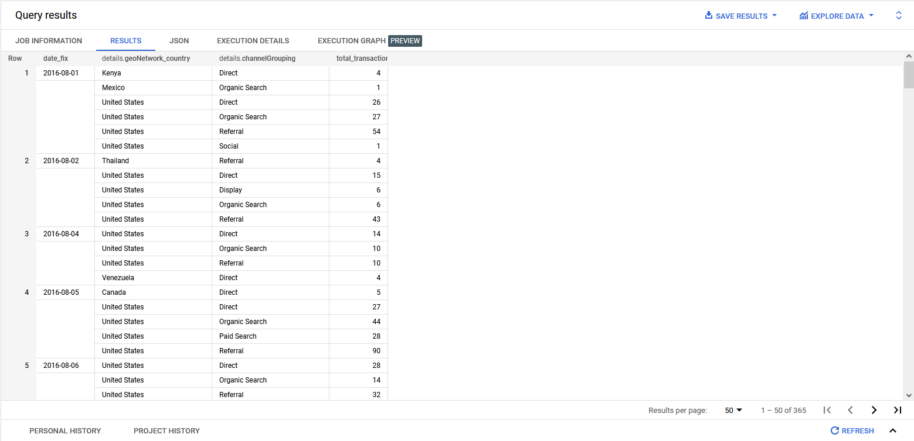

# Case 3 Data Fellowship 8 IYKRA

## Problems
From this public table `data-to-insights.ecommerce.rev_transactions`. Create an efficient query which
derives the total transactions per date and country based on the channel grouping! (Don’t forget to
clean the data and bonus point if using repeated columns)

## How to run the query
1. Open BigQuery on Google Cloud
2. Open a new query editor
3. Copy and Paste query from tugas3.txt to the query editor and click run

## Result
 