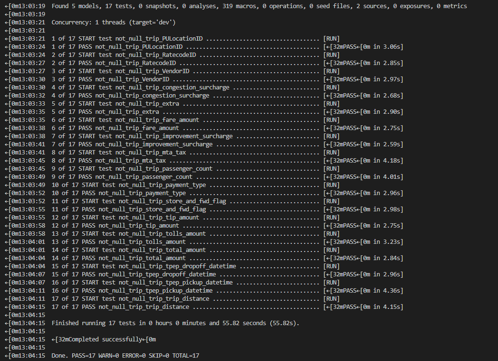
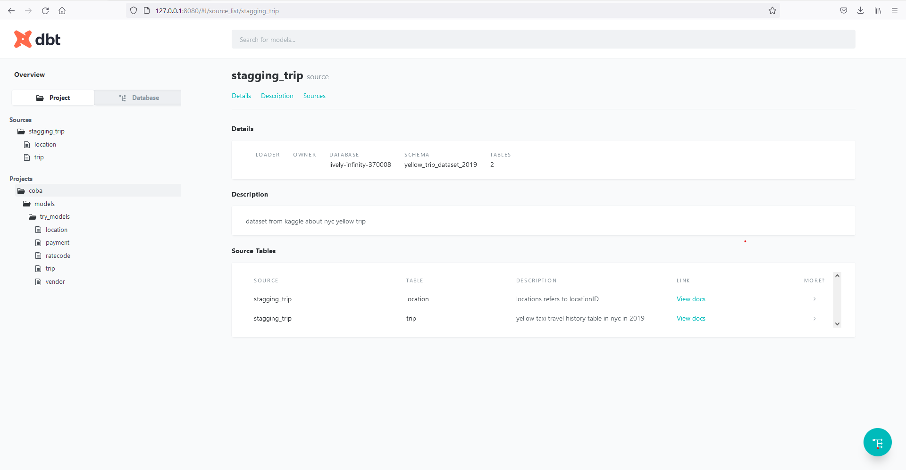
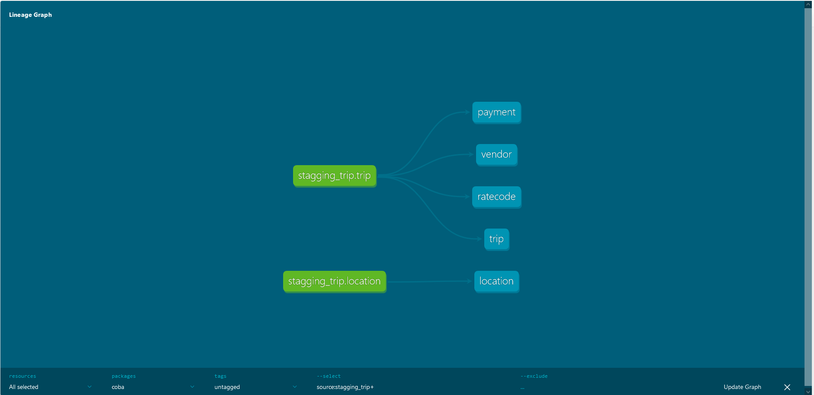

# Case 4 Data Fellowship 8 IYKRA

## Problems
Create a dbt transformation process for 2019 yellow trip data from raw data source, to staging data, to
data warehouse (dimension and fact model), and explain what data quality test you did.

Bonus if you also create the dbt documentation.

Data source:

https://www.kaggle.com/datasets/microize/newyork-yellow-taxi-trip-data-2020-2019?resource=downlo
ad or https://www1.nyc.gov/site/tlc/about/tlc-trip-record-data.page

## Data Quality Test
The project files are in coba folder.
In the trip table, I do a null value check on each column on it. 
Because the table has been transformed and the missing data has been inputted with data, all tests are declared successful.

## Result
 
 
 