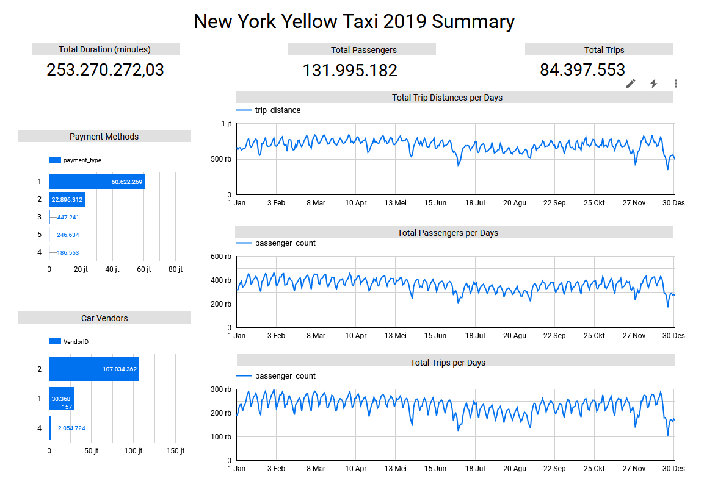
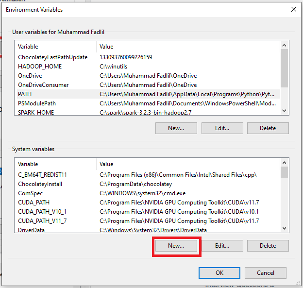
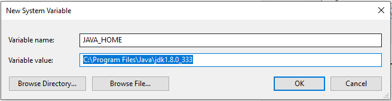
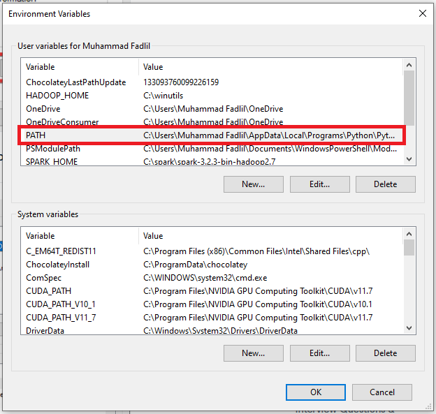
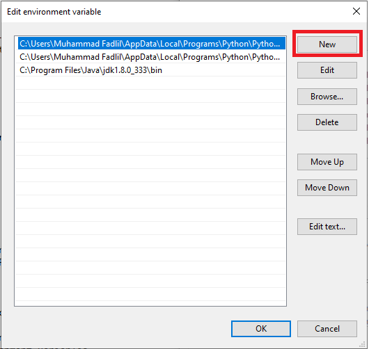
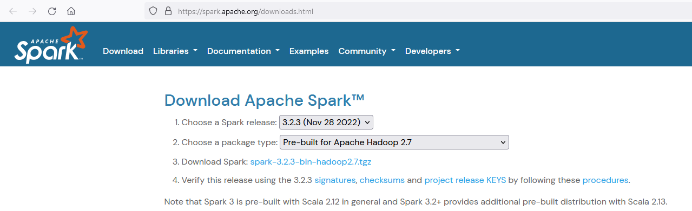
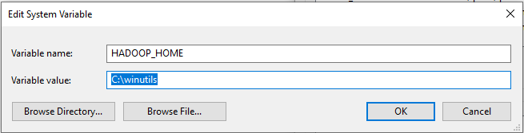
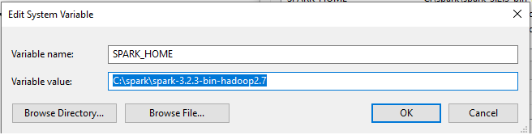
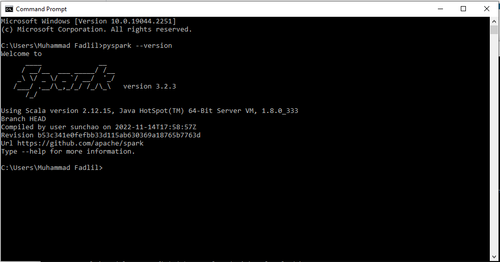

# Case 5 Data Fellowship 8 IYKRA

## Problems
Part 1 :

Create a dashboard with your own choice of tool with the yellow taxi trip records 2019 (dataset
pressumably is already there, or if not,

available to be downloaded here:
https://www.kaggle.com/datasets/microize/newyork-yellow-taxi-trip-data-2020-2019?resource=download 
or https://www1.nyc.gov/site/tlc/about/tlc-trip-record-data.page).

Put the dashboard url and the screenshot of the dashboard in the repo, with a little explanation about
the dashboard you made.

Part 2 :

Create a guide to install pyspark and put it in your repo. Print its version, screenshot it, and put the
screenshot in the repo.

## Data Visualization Result
Link : https://datastudio.google.com/s/r_pKHlerFSM

Create a dashboard about the number of trips, number of passengers and total travel time throughout 2019.

## How to Install PySpark in Windows?
1. You have to install Python, choose based on the version on the following link : https://www.python.org/downloads/. 
   Install the downloaded file, don't forget to choose "Add Python to environment variable" during the installation.

2. Download Java JDK on the following link : https://www.oracle.com/java/technologies/downloads/. Install the downloaded file.

3. In the windows search bar, search "Edit the system environment variables" and click it. 
   The System Properties window will appear and click "Environment Variables".

4. In the "System variables" section, click "New". Create variable "JAVA_HOME" and "Variable value" as "C:\Program Files\Java\jdk1.8.0_333".
   This is the location of your Java file.

5. In the "User variables" section, click "PATH" variable, a new window ("Edit environment variable") will appear, click New and fill the new line with the location of Java bin file ("C:\Program Files\Java\jdk1.8.0_333\bin")

6. Download Apache Spark on this link : https://spark.apache.org/downloads.html, select the latest Spark release and "Pre-built for Apache Hadoop 2.7" for the package type. 
   You can make a new folder called 'spark' in the C directory and extract the given file by using 'Winrar'

7. Download Winutils for Apache Hadoop 2.7 on this link: https://github.com/steveloughran/winutils/blob/master/hadoop-2.7.1/bin/winutils.exe
   Create folder "winutils" on the C directory, create folder "bin" inside it and put the downloaded file "winutils.exe" inside the bin folder.

8. Create 2 system new environment variables (the same way as step 4), HADOOP_HOME and SPARK_HOME, like the following pictures:

9. You have completed steps to install PySpark on Windows, open Command Prompt and type "pyspark --version", you can see the spark version like this:

