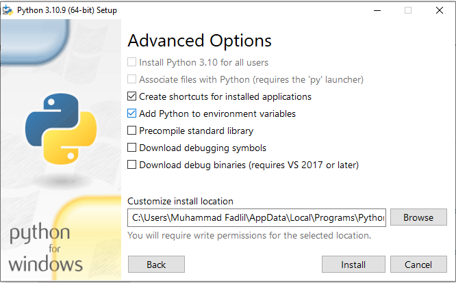
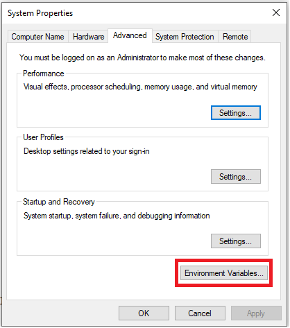

# Case 5 Data Fellowship 8 IYKRA

## Problems
Part 1 :

Create a dashboard with your own choice of tool with the yellow taxi trip records 2019 (dataset
pressumably is already there, or if not,

available to be downloaded here:
https://www.kaggle.com/datasets/microize/newyork-yellow-taxi-trip-data-2020-2019?resource=downlo
ad or https://www1.nyc.gov/site/tlc/about/tlc-trip-record-data.page).

Put the dashboard url and the screenshot of the dashboard in the repo, with a little explanation about
the dashboard you made.

Part 2 :

Create a guide to install pyspark and put it in your repo. Print its version, screenshot it, and put the
screenshot in the repo.

## Data Visualization Result
Link : https://datastudio.google.com/s/r_pKHlerFSM

## How to Install PySpark in Windows?
1. You have to install Python, choose based on the version on the following link : https://www.python.org/downloads/. 
   Install the downloaded file, don't forget to choose "Add Python to environment variable" during the installation.

2. Download Java JDK on the following link : https://www.oracle.com/java/technologies/downloads/. Install the downloaded file.

3. On the windows search bar, search "Edit the system environment variables" and click it. 
   The System Properties window will appear and click "Environment Variables".

