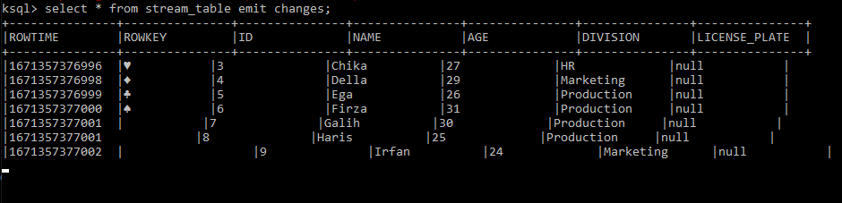
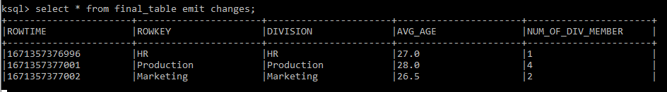

# Case 7 Data Fellowship 8 IYKRA

## Problems
Build a postgresql database and ksqldb server, can use
docker-compose.yml which has been shared.

Create table in the postgresql (table name and column are independent).

Create a stream in ksqldb that connects to the table in the postgresql
with the name stream_table.

Create a table in ksqldb named final_table, and source the table from
stream_table.

For task collection, you can attach a capture table result in postgresql and
capture stream and table results in ksqldb, as well as sql scripts in postgresql and ksqldb.


## How to run the program?

1. Clone this repository

2. Open Command Prompt and type this command below:
```
docker-compose up
```

3. Open Command Prompt and type this command below to create a table in PostgreSQL:
```
docker exec -it postgres psql -U postgres
```

4. Create a table inside Postgresql. For example, you can use using this query:
```
CREATE TABLE employees(
  id integer PRIMARY KEY,
  name VARCHAR(100),
  age integer,
  division VARCHAR(25),
);

INSERT INTO employees (id, name, age, division) VALUES
(1, 'Aldi', 22, 'HR'),
(2, 'Bagus', 25, 'Marketing');
```

5. Open Command Prompt and type this command below to start KSQLDB interactive CLI:
```
docker exec -it ksqldb-cli ksql http://ksqldb-server:8088
```

5. Inside KSQLDB CLI, create a connector to PostgreSQL using this query below:

```
CREATE SOURCE CONNECTOR jdbc_source WITH (
  'connector.class'          = 'io.confluent.connect.jdbc.JdbcSourceConnector',
  'connection.url'           = 'jdbc:postgresql://postgres:5432/postgres',
  'connection.user'          = 'postgres',
  'connection.password'      = 'password',
  'topic.prefix'             = 'jdbc_',
  'table.whitelist'          = 'employees',
  'mode'                     = 'incrementing',
  'numeric.mapping'          = 'best_fit',
  'incrementing.column.name' = 'id',
  'key'                      = 'id',
  'key.converter'            = 'org.apache.kafka.connect.converters.IntegerConverter');
```

6. Don't forget to check the topics using this query below, if the connection is success, a topic with name jdbc_employees will appear:

```
SHOW TOPICS;
```

7. Create a stream based on employees table on KSQLDB using this query below:

```
CREATE STREAM stream_table (
  id INTEGER,
  name VARCHAR(100),
  age INTEGER,
  division VARCHAR(25),
  license_plate STRING,
)
WITH (kafka_topic='jdbc_employees', value_format='json');
```

8. Create a table based on employees table on KSQLDB using this query below:

```
CREATE TABLE final_table AS
      SELECT division,
	     AVG(age) as avg_age,
	     COUNT(*) as num_of_div_member
      FROM stream_table
      GROUP BY division
EMIT CHANGES;
```

9. Type the query below on KSQLDB CLI to see the stream_table:
```
SELECT * FROM stream_table EMIT CHANGES;
```

10. Open the third Command Prompt and type this command below to start the second KSQLDB interactive CLI:
```
docker exec -it ksqldb-cli ksql http://ksqldb-server:8088
``` 

11. In the third Command Prompt or the second KSQLDB interactive CLI, type this command below:
```
SELECT * FROM final_table EMIT CHANGES;
```

12. In the PostgreSQL CLI type the query below to insert data to employees table:
```
INSERT INTO employees (id, name, age, division) VALUES
(3, 'Chika', 27, 'HR'),
(4, 'Della', 29, 'Marketing'),
(5, 'Ega', 26, 'Production'),
(6, 'Firza', 31, 'Production'),
(7, 'Galih', 30, 'Production'),
(8, 'Haris', 25, 'Production'),
(9, 'Irfan', 24, 'Marketing');
```
13. See the result in the first and second KSQLDB CLI, like the picture below:
<br>
<br>